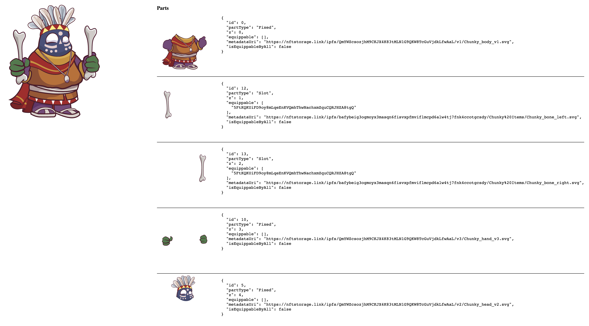

**NOTE: Still under development**

This repository showcases a collection of examples on how to use RMRK2 with Ink! [contract](https://github.com/rmrk-team/rmrk-ink) implementation.

The ispiration came from a very similar [project](https://github.com/rmrk-team/rmrk2-examples) targeting RMRK2 pallet.

This is a monorepo, so do `yarn install` from the root of this repo.

### Scripts

Under `/projects/scripts` you can find scripts for deploying contracts, building NFT parts catalog and building a single Chunky NFT.

Before runing scripts install and run the latest [Swanky Node](https://github.com/AstarNetwork/swanky-node)

After Swanky Node is up and running navigate to the folder above and execute the command

`yarn run-all`
 
 which will perform all the steps above. The scripts deploys two contracts, one with chunky NFT and another with Chunky parts and catalog.

 In the script output look for contract addresses they will be needed later.

```
Deploying contracts
Deploying Chunky contract...
Chunky contract deployed at address 5F4Aoy2nfGeRLZXF7mm4gk7ZhymXy4EaMRBKzjkNthpUJ8nk
Deploying Chunky Parts contract...
Chunky Parts contract deployed at address 5FtKQKUiFD9oy8mLqeEnKVQmhThwNachxmZquCQRJHZA8tgQ
Building parts catalog
Adding base parts
```

### UI
Under `/projects/ui` you can find simple Vue app to display the NFT previously built



Update contract addresses in `useNft.ts` with the ones got from the script output.

Navigate to the folder above and execute
`yarn dev`

Open local page (most likely `http://127.0.0.1:5173/`) in web browser to display the NFT.
